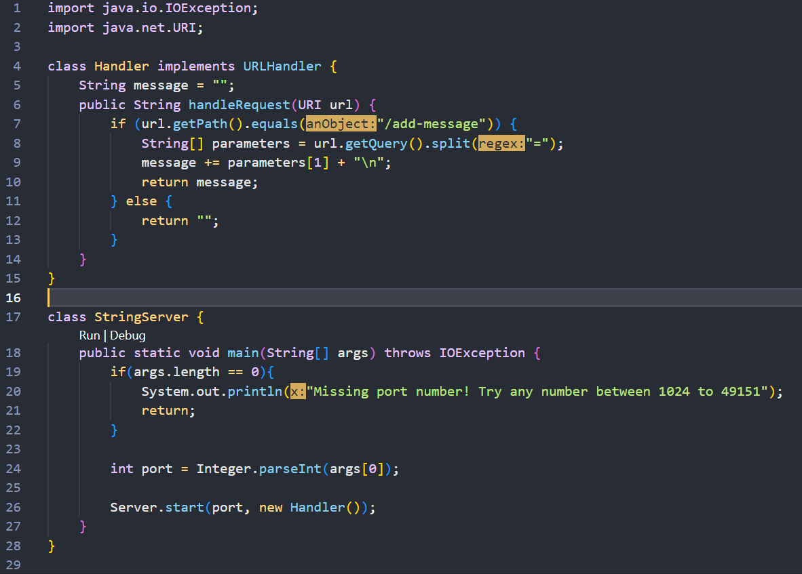
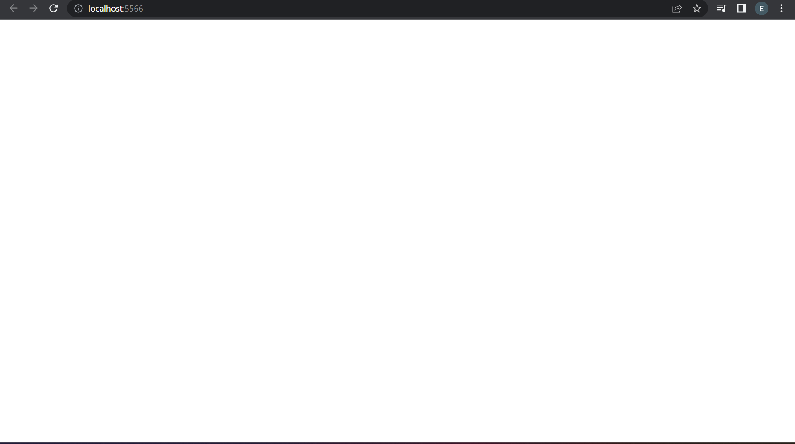
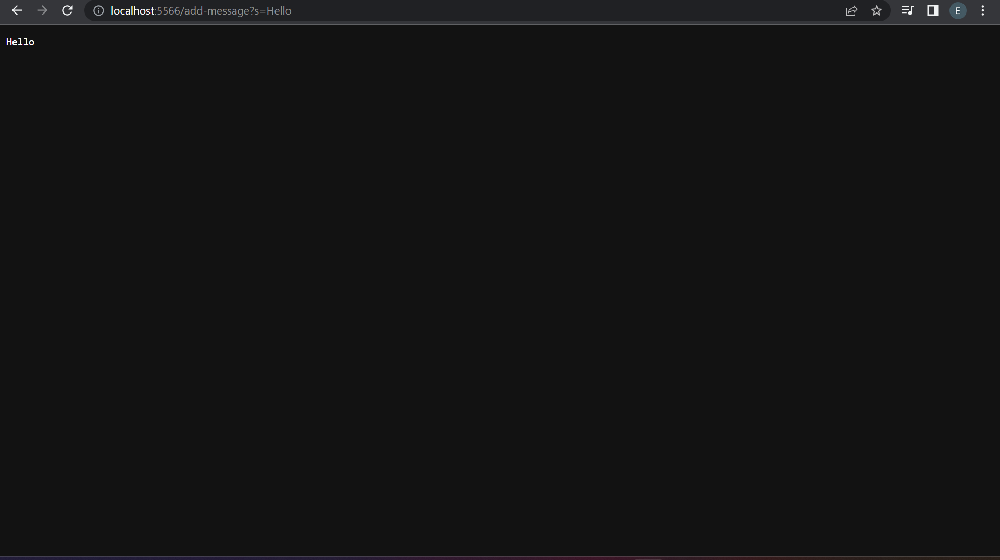
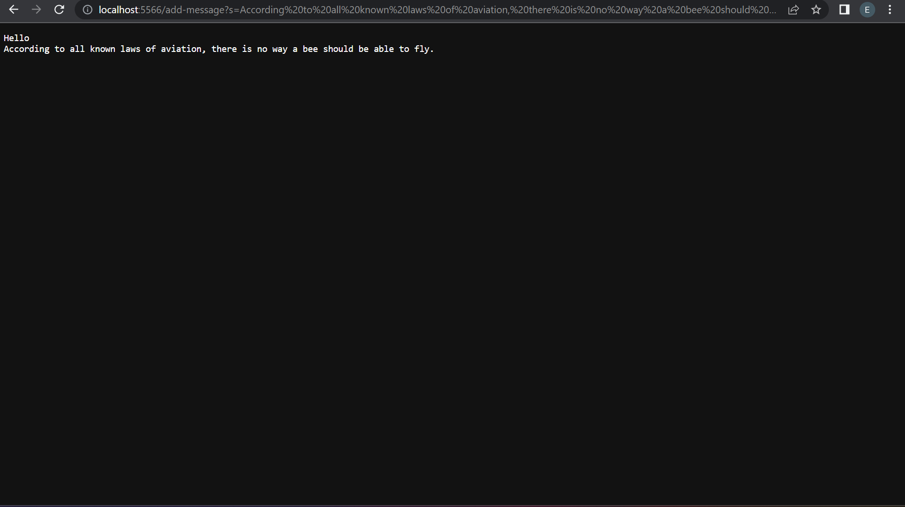
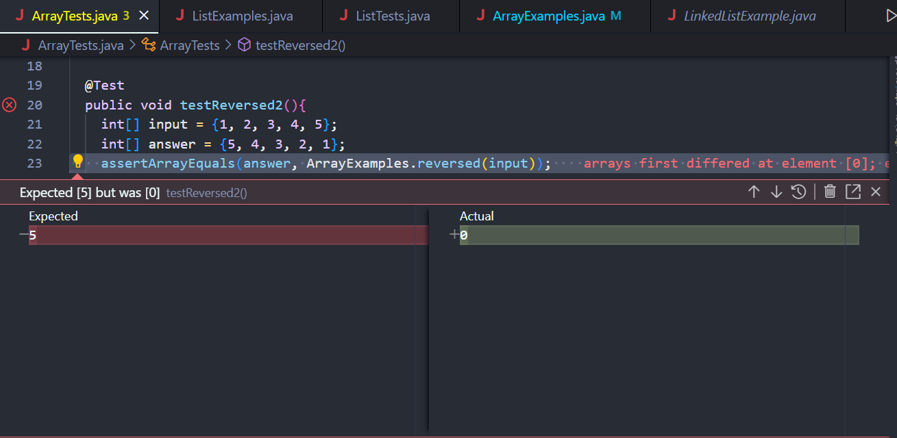
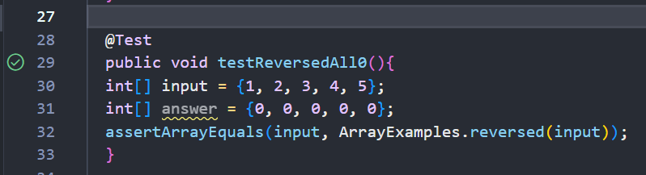

# Making a Website (Kind of) and Bugs (ew)
## A Tutorial for UCSD Students


---

Welcome back. If you're returning to me to learn more, that means that my previous tutorial was acceptable. Splendid. I do hope that this one will also fulfill your needs. Oh, and the rate is still the same. Don't worry though, you've already been billed. Lets get started.

---
## Part 1: The Code Behind it All
### What really happens on a server 

Important: This tutorial assumes you have the wavelet repository copied and forked from the man the myth the legend himself: Joe Politz. This includes all the class files, java files like `NumberServer.java` and `Server.java`, and the most important: the `README.md` because I actually read the `README.md` file and as soon as I did I expanded my vocabulary by exactly one word, and let me tell you what an experience that was.

Ok so clarification: I am *technically* running my own website, but I don't have enough knowledge to tell you exactly what is happening. Gonna be honest with you: my professor kinda just gave us the code an said "!@#$ around and find out." So that's what I did.

Anyway, let's say I have a small website running on my computer. All it does it take a message you type in the url and prints it on the page. Simple right? Not really.

Here's some of the code for that website:



I've decided to use a screenshot so that you can see all the pretty colors (and so you can't copy paste haha).

To get the server running, type these two commands into your terminal:
```
javac StringServer.java, Server.java
```
```
java StringServer 4000
```
Where `StringServer.java` is the file that has all the code for actually doing stuff on the website, and `4000` is any four digit number. Seriously you can name it 6969 if you want. One of my groupmates did that and it was kinda stupid but also funny.

If you run those two commands, you'll see this:



Ah, magnificent isn't it.

This white screen is kinda interesting to me, because if you do the same process but with `NumberServer.java` instead, you'll see a black screen. My guess is that if the server has nothing to print/show, it will go to white screen. As soon as it has something to show though, it changes to black screen so you can see the white text. Just my theory though.

But hear me out, if you add `/add-message?s=Hello` onto the back of the url already there (which means your url bar should look like `http://localhost:5566/add-message?s=Hello`), then you'll see this:



Woah! Crazy! Amazing! Eugene how did you do that!

Well, spoiler alert: I'm a wizard. A coding wizard haha (please don't give me a 0).

In reality, all I did was give the website a **path** and a **query**. A path tells the website what to do, and a query is what the website does with. The wording is a tad weird, but think of it like this: In the example above, your url should look like this, `localhost:5566/add-message?s=Hello`. The **path** is the `/add-message` that tells the website you want to add a message to it. The **query** is the `?s=Hello??` part, which tells the website what you want to add, in this case you are adding "Hello". 

Now for some technical stuff (that I have to put in here): The methods being called in `StringServer.java`, which is where this is all happening, are the main method and the **handleRequest** method. The main method is in the **StringServer** class, and **handleRequest** is in the **Handler** class. 

The only relevant argument for **handleRequest** is the URI **url**, which is the url of the website. There are two relevant fields (of **Handler**), String **message** which holds the message part of the query you want to add to the website, and String array**parameters,** which is an array of Strings that holds each part of the query that is split by the = sign. In the first spot (index 0) it holds "s", and in the second is "Hello." 

Both **message** and **parameters** change each time you type in a new thing to add, **message** will update to have the new message you want to add on a new line, and **parameters** will update to the new **query** part of the url. **URI** will also change to whatever new url you have decided to type.

Ok, that was a lot of text. We need some images. Here, I added another message to the website:



Here, the same methods are being called, the main method and **handleRequest.** The arguments for **handleRequest** is the new url, which as you can see is this abysmal thing
```
http://localhost:5566/add-message?s=According%20to%20all%20known%20laws%20of%20aviation,%20there%20is%20no%20way%20a%20bee%20should%20be%20able%20to%20fly.
```
Quick note: not only is my argument long but also every space was replaced with %20, wihch I'm guessing is the label for a space.

Anyway, the same methods are called, the main method and **handleRequest**. Same relevant argument, **url**, which is changed to the new url at the top. The **message** field is updated to include the message "According to all knwon laws of aviation, there is no way a be should be able to fly.", and **parameters** holds "s" as usual in the first spot, and our new message in the second. 

To summarize, **message,** **parameters,** and **url** will all be updated everytime a new message is added to the query part of the url (provided you use the same path). **message** will be the message you want to add, **parameters** will have "s" in the first slot and your message in the second, and **url** will be the url of the ewbsite that includes your message.

Wow that was a lot. If you made it this far, feel free to send me a tip so I can get some good food tonight instead of dining hall food. Or don't, but then I will be sad. And you don't want that right? Right?

## Part 2: Debugging
### When the code don't work

We've all had that time when our code looks fine and yet it still won't run or gives some wonky input. So, what should you do? The answer is: switch majors!

Just kidding. You should write some tests, to test inputs and outputs of your code. That's exactly what I will be showing you.

We will be using JUnit, a very popular (and quite useful) testing package.

Here is an example of some code written by who knows who:

```
static int[] reversed(int[] arr) {
    int[] newArray = new int[arr.length];
    for(int i = 0; i < arr.length; i += 1) {
      arr[i] = newArray[arr.length - i - 1];
    }
    return arr;
  }
  ```
Here's the issue: it doesn't work. This method is supposed to return a new array that is the reverse order of the **arr** array it just returns an array of all 0s.
For example here is a failure-inducing input for the test:
```
@Test
  public void testReversed2(){
    int[] input = {1, 2, 3, 4, 5};
    int[] answer = {5, 4, 3, 2, 1};
    assertArrayEquals(answer, ArrayExamples.reversed(input));
  }
```
And here is the symptom (or the behavior we see as a result of running the test): 



As you can see, the test expects the first element to be 5, as 5 is the last element of **arr.** The method, however, says no and returns 0.

But it does work. For an array of all 0s:
```
@Test
  public void testReversedAll0(){
  int[] input = {1, 2, 3, 4, 5};
  int[] answer = {0, 0, 0, 0, 0};
  assertArrayEquals(input, ArrayExamples.reversed(input));
  }
```
 Here's the symptom for that: 
 
 
 
So what's wrong? Well I'm glad you asked.

The orignial code has two problems: first is that in it's for loop, it is changing the argument array **arr** instead of **newArray**, which is the one we want to return. Second, it's returning **arr** instead of **newArray**. What this means is that instead of setting the first element of **newArray** to the last element of **arr**, it sets the first element of **arr** to the last element of **newArray** (which is 0). And in returning **arr**, it is returning an array of all zeroes, because **newArray** was initialized to be empty.

So how do we fix it? Well, here's the problematic code again:

 ```
static int[] reversed(int[] arr) {
    int[] newArray = new int[arr.length];
    for(int i = 0; i < arr.length; i += 1) {
      arr[i] = newArray[arr.length - i - 1];
    }
    return arr;
  }
 ```
 And here's the fix for that. 
 ```
 static int[] reversed(int[] arr) {
    int[] newArray = new int[arr.length];
    for(int i = 0; i < arr.length; i += 1) {
      newArray[i] = arr[arr.length - i - 1];
    }
    return newArray;
  }
  ```
  
By switching the **arr** and **newArray** parts of the for loop, now the first element in **newArray** will be set to the last element of **arr,** just like we want it to. This will also work for the rest of the loop.
I've also changed the return statement to return **newArray** instead of **arr,** so we get the new array with the reverse of **arr** instead of an array of all zeroes.

And that's it for this tutorial. Remember to pay your billing statment so I can keep going here (it ain't cheap you know).

Thanks for reading!


 


