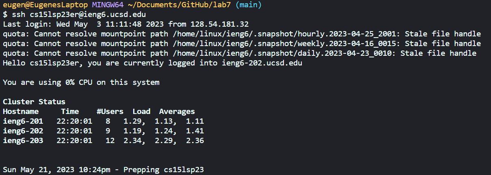
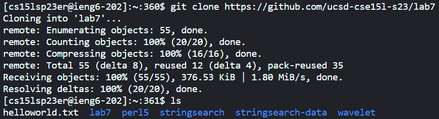
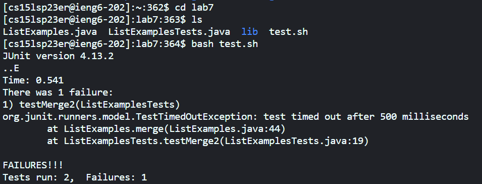
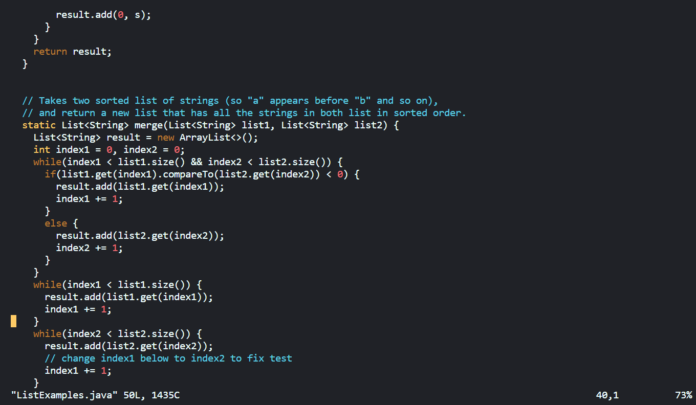
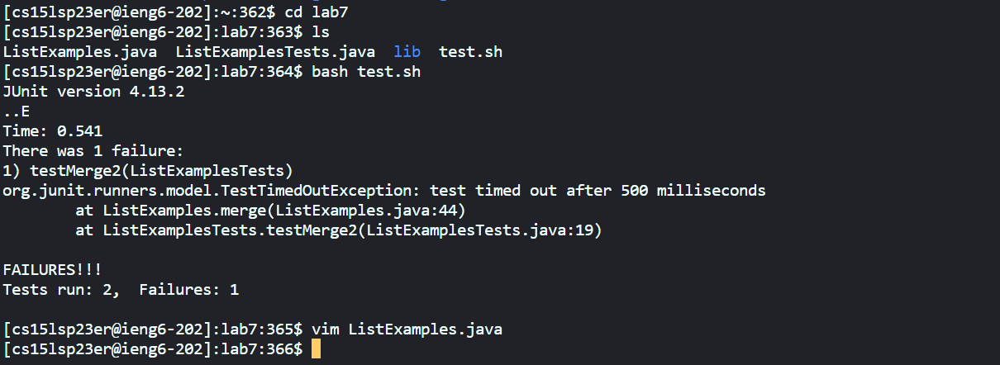
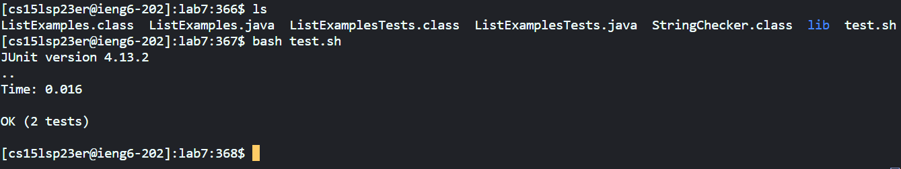
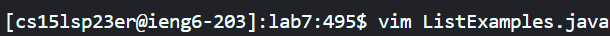
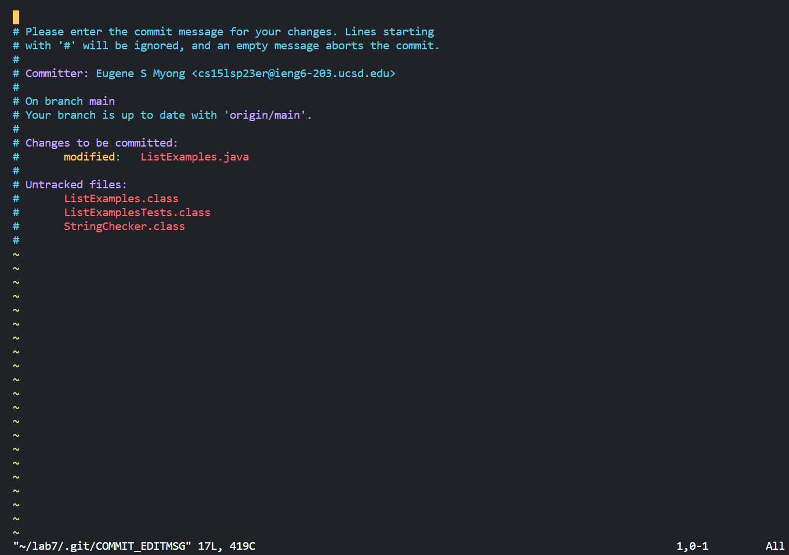
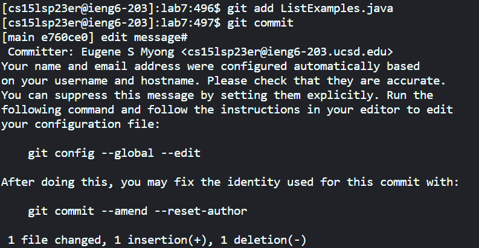
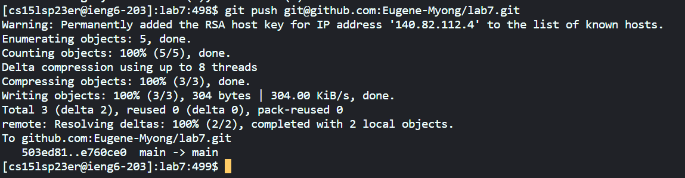

# Command Line
## Bro your are literally vim

---

Greetings and welcome back. Today is less of a tutorial and more of a record of my steps for you to read and follow. Dont worry, I'll only charge you $145.

I apologize for the weird side scrolling bars thing with the last Lab Report. I do hope it doesn't happen with this one. Never seen anything like it either, and google 
surprisingly had nothing for me. Weird. 

Nevertheless, let's get started.

---
## Part 1: Vim
### No I didn't misspell him these commands are just spelled weird ok

Note: Feel free to skip past this part if you already know **vim**

Today I shall show you how I made a simple edit through the command line. I know right, you don't have to edit the file directly, you can use **vim** 
and the command line and still make any edits! Pretty cool.

Before we get started though, you need to understand what I'm doing. Well, you've come to the right place. Enter: Vimtutor Eugene Edition!

---
### Vimtutor: Eugene Edition

Note: Keys on your keyboard will be shown as `key`, and when the key looks like `<key>`, that means press that key.

**Entering vim**: To start editing a file with **vim**, type: vim (filename) `<ENTER>`, with (filename) being the name of the file you want to edit. This will pull up the entire file in the command line and start the **vim** editor.

**Moving around**: When you enter a file with the **vim** command, you will be able to freely navigate the contents of that file using your cursor. The easiest way to do this is through the arrow keys, with each arrow key corresponding to their directions. If you don't have any arrow keys though, fear not, for you can use `h` to go left, `l` to go right, `k` to go up, and `j` to go down. 

**Normal Mode**: Normal mode is where you can naviagte the file with your cursor. Whenever you enter another mode and want to get back to normal mode, press `ESC`.

**Deleting a character**: To delete a character, all you have to do is press `x` and the character under your cursor will be sent to the shadow realm. Sorry buddy.

**Insertion Mode**: To insert a character, press `i` and you will enter insertion mode. Move your cursor to wherever you want to insert the character and start 
typing away. The character that was under your cursor will be pushed to your right. In other words, your cursor will cover the same character the entire time you're typing,
and insert characters directly to the left of your cursor.

**Appending Mode**: To append test, press `SHIFT` and `A` at the same time (press and hold `SHIFT` and press `A`). This will send your cursor to the end of the line, and from there everything you type will be added to the end of the line. 

**Repeated commands**: Sometimes you need to perform a command multiple times. Well instead of pressing `DOWN` 43 times like I did, just type: 43 `<DOWN>`, and your cursor will move down 43 times. Putting a number before a command will execute the command that many times. Very handy.

Once you are leave to exit, you have two options:
1. **Exiting and saving all changes**: To exit and save all changes, type :wq `<ENTER>`
2. **Exiting and deleting all changes**: to exit and not save any changes, type :q! `<ENTER>`

And that's it! Hopefully now you have a basic understanding of how to use **vim**. I've only included what I think is necessary to complete what this Lab Report entails, but if you'd like to learn more about vim, log into your ieng6 account and type: *vimtutor* `<ENTER>`.

---
## Part 2: The Steps
### Living on the 13th floor of Kaleidoscope, I am very familiar with steps. Oh not those kind? Nevermind then.

Here are the steps that I will be doing today:
1. Log into ieng6
2. Clone your fork of the repository from your Github account
3. Run the tests, demonstrating that they fail
4. Edit the code file ListExamples.java to fix the failing test (as a reminder, the error in the code is just that index1 is used instead of index2 in the final loop in merge)
5. Run the tests, demonstrating that they now succeed
6. Commit and push the resulting change to your Github account

I'll include pictures of every step one I have completed them. I also have to record **every single button that I press** (😡), so you'll be able to follow along with me too.

For my starting point, I have Visual Studio Code open and the terminal ready. I have also forked and cloned this repository `https://github.com/ucsd-cse15l-s23/lab7`.

Last note (I promise) if I type (hold) after a key I am only holding it until the next key press. For example, `<SHIFT>`(hold) `<k>` means I am typing a K (capital k).

---
### Step 1: Long into ieng6

Keys Pressed: `<CTRL>`(hold) `<V>`(I had "ssh cs15lsp23__@ieng6.ucsd.edu" copied) `<LEFT>` `<LEFT>` `<LEFT>` `<LEFT>` `<LEFT>` `<LEFT>` `<LEFT>` `<LEFT>` `<LEFT>` `<LEFT>` `<LEFT>` `<LEFT>` `<LEFT>` `<LEFT>` `<LEFT>` `<DELETE>` `<DELETE>` `<e>` `<r>` `<ENTER>`

For this step all I did was copy paste the command to log into the terminal and hit `<ENTER>`. The `<DELETE>` and `<LEFT>` was just me replacing the two underscores with my id.

---
### Step 2: Clone the fork of the repo into my ieng6 account

Keys Pressed: `<CTRL>`(hold) `<V>`(I had "git clone https://github.com/ucsd-cse15l-s23/lab7" copied) `<ENTER>` `<l>` `<s>` `<ENTER>` 

Here I cloned the repository and used the command *ls* to see all the directories inside.

---
### Step 3: Run tests to show they fail

Keys Pressed: `<c>` `<d>` `<l>` `<a>` `<b>` `<7>` `<ENTER>` `<l>` `<s>` `<ENTER>` `<b>` `<a>` `<s>` `<h>` `<SPACE>` `<t>` `<e>` `<s>` `<t>` `<.>` `<s>` `<h>` `<ENTER>`

I started with changing directories to **lab7**, then using *ls* to see all the files inside, and finally running the **test.sh** bash script to run the tests and show they fail.

---
### Step 4: Making the edit

Keys Pressed: `<v>` `<i>` `<m>` `<SPACE>` `<SHIFT>`(hold) `<l>` `<i>` `<s>` `<t>` `<SHIFT>`(hold) `<e>` `<x>` `<a>` `<m>` `
` `<l>` `<e>` `<s>` `<.>` `<j>` `<a>` `<v>` `<a>` `<ENTER>`

For this first image, I ran *vim* in the **ListExamples.java** file so I could make the edit. 

Keys Pressed: `<DOWN>` `<DOWN>` `<DOWN>` `<DOWN>` `<RIGHT>` `<RIGHT>` `<RIGHT>` `<RIGHT>` `<RIGHT>` `<RIGHT>` `<RIGHT>` `<RIGHT>` `<RIGHT>` `<RIGHT>` `<RIGHT>` `<RIGHT>` `<x>` `<i>` `<2>` `<ESC>` `<SHIFT>`(hold) `<;>` `<w>` `<q>` `<ENTER>` 

Here, I moved my cursor over the one that needed replacing, removed it, and put a two in it's place. I then saved the edits. Here's what it looks like after that final `ENTER`:

---
### Step 5: Run tests to show they pass

Keys Pressed: `<l>` `<s>` `<ENTER>` `<b>` `<a>` `<s>` `<h>` `<SPACE>` `<t>` `<e>` `<s>` `<t>` `<.>` `<s>` `<h>` `<ENTER>`

After running *ls* I ran the **test.sh** script again to run the tests and show that this time they passed.

---
### Step 6: Committing and pushing

Keys Pressed: `<g>` `<i>` `<t>` `<SPACE>` `<a>` `<d>` `<d>` `<SHIFT>`(hold) `<l>` `<i>` `<s>` `<t>` `<SHIFT>`(hold) `<e>` `<x>` `<a>` `<m>` `
` `<l>` `<e>` `<s>` `<.>` `<j>` `<a>` `<v>` `<a>` `<ENTER>` 

For this image, I used the command *git add ListExamples.java* to add **ListExamples.java** to the list of things that I want to commit and push.

Keys Pressed: `<g>` `<i>` `<t>` `<SPACE>` `<c>` `<o>` `<m>` `<m>` `<i>` `<t>`  `<ENTER>`

Next, I ran *git commit* to enter this screen that prompts for an edit message. The edit message I typed was just "edit message" which was 20 spaces down (because the lines starting with # would be ignored), and the keystrokes I used are down below:

Keys Pressed: `<2>` `<0>` `<DOWN>` `<i>` `<ENTER>` `<e>` `<d>` `<i>` `<t>` `<SPACE>` `<m>` `<e>` `<s>` `<s>` `<a>` `<g>` `<e>` `<ESC>` `<SHIFT>`(hold) `<;>` `<w>` `<q>` `<ENTER>` 

Here's what it looks like after that final ENTER:

That extra # is there after edit message because I forgot to delete it. Whoopsie.

Keys Pressed: `<ENTER>` `<g>` `<i>` `<t>` `<SPACE>` `
` `<u>` `<s>` `<h>` `<SPACE>` `<CTRL>`(hold) `<v>`(I had "git@github.com:Eugene-Myong/lab7.git" copied) `<ENTER>`

Finally, I pushed the changes to my fork of the repository.

## Part 3: Completion
### FINALLY THANK GOD

Oh my god. No offense, but that was definitely my least favorite lab. Tracking **every single keystroke** was so tedious and I panicked because **git push** wasn't working because the first 40 times I tried it I forgot to include the ssh link. Nice one Eugene. 

But all's well and done now. I hope you were able to follow my process and the keystrokes I included were accurate. Of course, they are not exact for you, some keys may be different or you may have found a better way to do it, and chances are I messed up a key or two. Hope that's forgivable.

Nonetheless, as always, thanks for reading!

