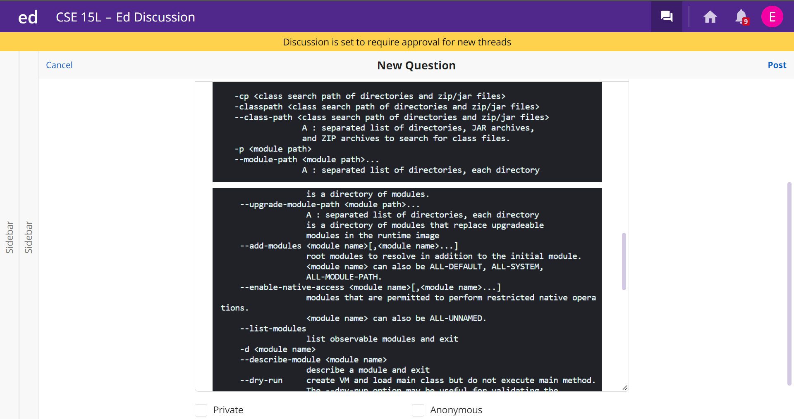

# Debugging 
## Why give a syntax error when it isn't a syntax error?????


---

At long last, we have finally arrived at the final lab report. It feels like only yesterday I was figuring out why my cat image wouldn't display correctly. 

I'd like to thank you for sticking with me as I tried my hand at creating some blog posts. I found it to be quite fun actually (except for Lab Report 4) but I realized that 
I didn't dread doing it like essays and I actually remembered the stuff I was writing about. That's crazy honestly, doing something I enjoy makes it easier and I remember it 
better. Who would have guessed?

Since you've been so loyal to me, I'd like to present this last Lab Report on the house. I promise I won't make it any worse than the others, although it's less of a tutorial
and more of a conversation. Who knows, maybe you might find yourself in the very same situation as this student did, and it might be helpful. You'll have to read on to find 
out.

Quick Note: Right as I was about to submit this I noticed those dastardly Side Scrolling Bars again. Sorry about that, still don't know what's causing them. The first one kind of makes sense since the pdf version cuts off the full line, but the second one is random.

And with that, let's get started.

---
## Part 1: The Scenario
### The Question

For this Lab Report, my task is to simulate the conversation a student would have with a TA about an issue with their code. Obviously, I know what the error is and how to fix
it, but I don't want to spoil the fun for you. So you get to go into this with no idea what's happening. See if you can predict the fix to the issue though!

My good friend Eugen (yes that's spelled correctly, pronounced *you-JEN*) is having an issue with his code. Unable to figure it out on his own, he made a post on EdStem 
asking for some help. Here's his post before he hit send:





Just for easier viewing, here are the three screenshots he included:


### The Response

A couple hours later, a TA by the name of Eublene (also spelled correctly, pronounced *you-BLEEN*) responded to Eugen's post. How helpful!

Here's his response:


### The Second Attempt

After recieving advice from Eublene, Eugen decided to try that advice out. He went into the *grade.sh* file and switched all the `;`s to `:`s in the lines that referenced 
either hamcrest or junit.

Here's the result:


It appears that it works now! This means that the bug was that Eugen was using the windows specific `;` instead of the general `:` when referencing hamcrest and junit.
How silly of him! He should have definitely read through the entirety of the Lab Report before actually doing it! Not like this exact same thing happened to me or anything
(yes it did).

### The Info

Here's some essential information to understanding the files Eugen was dealing with: 

In Eugen's ineg6 account, here's his home directory:


Here's his *grader-review-cedr1cjr* directory:


Cedric Jr was his lab partner, and he was the one who made the directory in Week 8. Shoutout to him.

Here's what's inside *lib*:


So he wasn't lying, there really was the *hamcrest* and *junit* files in the directory. 

To view the student submission repository that was used in this scenario, go to this link: https://github.com/ucsd-cse15l-f22/list-methods-corrected.
This repo has the java file that was used, specifically *ListExamples.java*.

And if you're too lazy to click a single link, here is *ListExamples.java*.

```
import java.util.ArrayList;
import java.util.List;

interface StringChecker { boolean checkString(String s); }

class ListExamples {

  // Returns a new list that has all the elements of the input list for which
  // the StringChecker returns true, and not the elements that return false, in
  // the same order they appeared in the input list;
  static List<String> filter(List<String> list, StringChecker sc) {
    List<String> result = new ArrayList<>();
    for(String s: list) {
      if(sc.checkString(s)) {
        result.add(s);
      }
    }
    return result;
  }


  // Takes two sorted list of strings (so "a" appears before "b" and so on),
  // and return a new list that has all the strings in both list in sorted order.
  static List<String> merge(List<String> list1, List<String> list2) {
    List<String> result = new ArrayList<>();
    int index1 = 0, index2 = 0;
    while(index1 < list1.size() && index2 < list2.size()) {
      if(list1.get(index1).compareTo(list2.get(index2)) < 0) {
        result.add(list1.get(index1));
        index1 += 1;
      }
      else {
        result.add(list2.get(index2));
        index2 += 1;
      }
    }
    while(index1 < list1.size()) {
      result.add(list1.get(index1));
      index1 += 1;
    }
    while(index2 < list2.size()) {
      result.add(list2.get(index2));
      index2 += 1;
    }
    return result;
  }


}
```

Below is the contents of *grade.sh* before Eugen changed the `;`s to `:`s:

```
CPATH='.:lib/hamcrest-core-1.3.jar:lib/junit-4.13.2.jar'

rm -rf student-submission
rm -rf grading-area

mkdir grading-area

git clone $1 student-submission
echo 'Finished cloning'


# Draw a picture/take notes on the directory structure that's set up after     
# getting to this point

# Then, add here code to compile and run, and do any post-processing of the    
# tests

if [[ -f $1 ]] && [[ $1 != "ListExamples.java" ]]
then
echo "Wrong file/s submitted."
exit
else
echo "Right File Submitted"
cp student-submission/ListExamples.java grading-area
cp TestListExamples.java grading-area
cp -r lib grading-area
cd grading-area
javac -cp .;lib/hamcrest-core-1.3.jar;lib/junit-4.13.2.jar *.java
if [[ $? == 1 ]]
then
echo "Compile Error in Submission"
exit
else
java -cp .;lib/hamcrest-core-1.3.jar;lib/junit-4.13.2.jar org.junit.runner.JUnitCore TestListExamples
status=$?
if [[ $status == 0 ]]
then
echo "Test Passed"
elif [[ $status == 1 ]]
then
echo "Test Failed"
else
echo "Weird Exit Code"
fi
fi
fi
```

To trigger the bug, Eugen typed into the command line:
```
bash grade.sh https://github.com/ucsd-cse15l-f22/list-methods-corrected
```

To fix the bug, all he had to do was change the `;`s to `:`s in these two lines:
```
javac -cp .;lib/hamcrest-core-1.3.jar;lib/junit-4.13.2.jar *.java
```
```
java -cp .;lib/hamcrest-core-1.3.jar;lib/junit-4.13.2.jar org.junit.runner.JUnitCore TestListExamples
```
Which was a grand total of four edits. That's it. Literally four characters were making his whole program fail. It do be like that in CS though don't it?

---
## Part 2: Reflection
### Why would I need to analyze my reflection? It's literally me

Something I learned in the second half of the quarter that I quite enjoyed was **vim**. The idea of editing a file without being in that file isn't something that I had
considered previously. I mean, I knew it was possible but I couldn't think of a reason to need to do it. Now that we have remote servers with ieng6 and files that exist there
and not on our machine though, it makes sense. Instead of having to go through the whole process of getting the file from ieng6 then opening my editor and editing it then
having to update the file in ieng6 and blah blah blah, I can just go "**vim**" and voila I can edit it right then and there. Literally magic (ok not literally). 

This is gonna be really useful if I have to work on files in another server like at my job or for a group project. Overall, **vim** is a really cool concept that those 
without technological expertise don't really consider to be important, but boy is it. The convenience that **vim** provides is unbounded, and I can see it being an essential
skill for all CS jobs in today's world.

## Part 3: Closing Thoughts
### Brings a tear to my eye

Man, here we are. The end of the last Lab Report. I quite enjoyed this course overall. Very low stress and not a lot of work, which I suppose is standard for a two unit 
class. Nonetheless, I enjoyed how Joe led the lectures (even though admittedly I stopped going to them around Week 7, nothing on him I just burnt out around then for all my 
classes), and I really felt I was learning something useful in both lectures and labs. This was the first course where I felt I was learning something I can apply rather 
than something the CS department says I have to learn, which may be ironic because the CS department may have said I have to learn all this stuff but small details never
hurt anybody.

Except Eugen, one small details caused his whole project to crash. Hm.

Ok so small details are important, but that's not what I'm trying to say. I'm trying to say that I enjoyed this course, and I hope that more of my future classes are similar,
especially the Lab Report Part. I enjoy being able to talk like myself and reading the comments the graders left for me. 

Also, I do hope I get a 3/3 for this one. I'm not asking you to give me a 3/3, I'd much rather you grade this honestly. But getting 3/3 for every Lab Report first try is
quite the flex. Not it's not, but it's be one of my smaller bragging topics, and pretty cool though. But please don't just give me a 3/3 cause it would be cool, grade this
as you see fit. 

I appreciate you for grading my Lab Reports, whether you graded one or all of them. And I hope that if I or someone else ever needs these in the future that this will 
actually be helpful.

I'd like to give some shoutouts!

First, to Joe for teaching an interesting class and making it interesting as well. He made the class fun and managed to teach something at the same time, quite impressive.

Second, to Haitong, my Lab TA. Always helpful and the first to notice my Cat pictures.

Third, to Barack Obama, the former President of the United States of America. I always forget his last name though. Sorry Obama, I'll remember someday.

And lastly, to you, the reader. These Lab Reports would serve no purpose without you reading them. Ok they're made for my grade but that's not nearly as important as having 
someone enjoy what I make. At least I hope you enjoyed them. 

And with that, I conclude this Lab Report. 

As always,

Thanks for reading!

